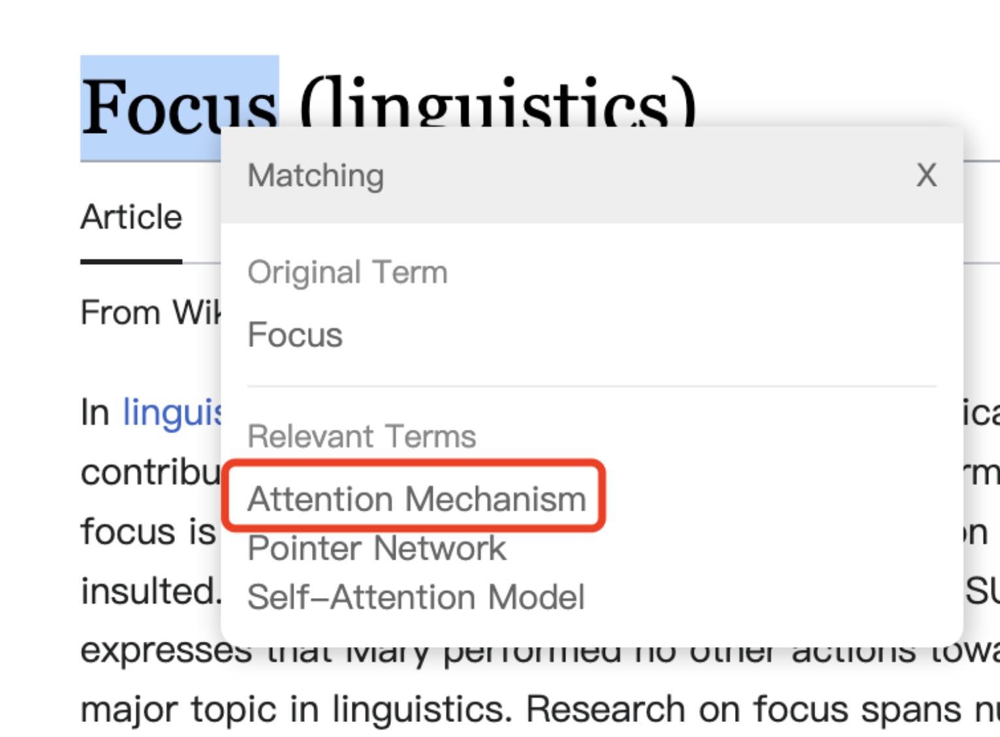
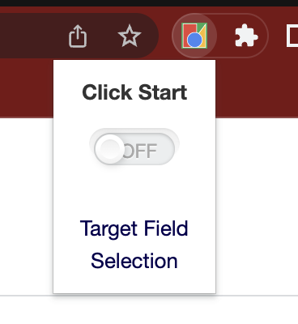
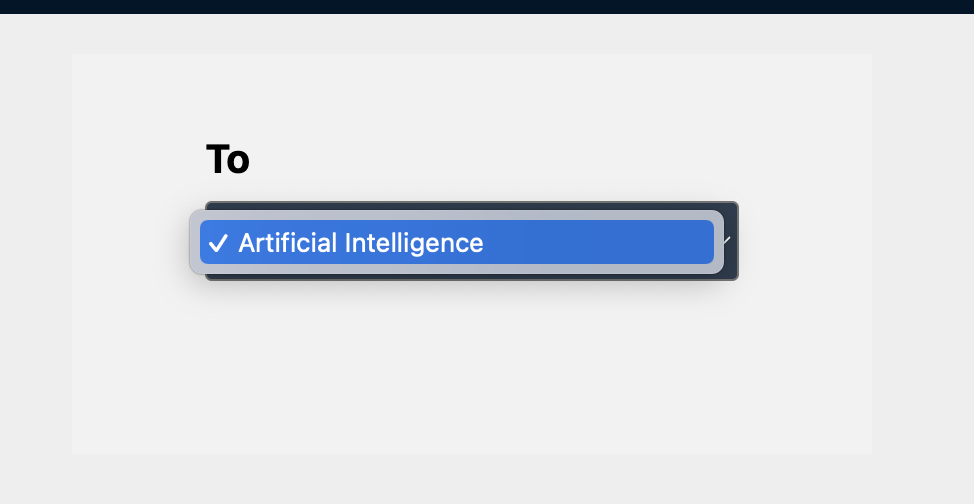
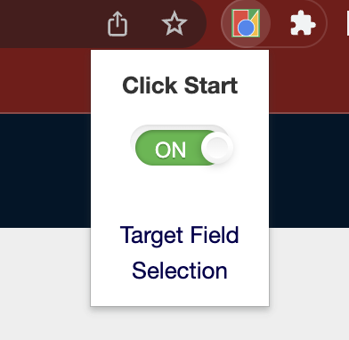
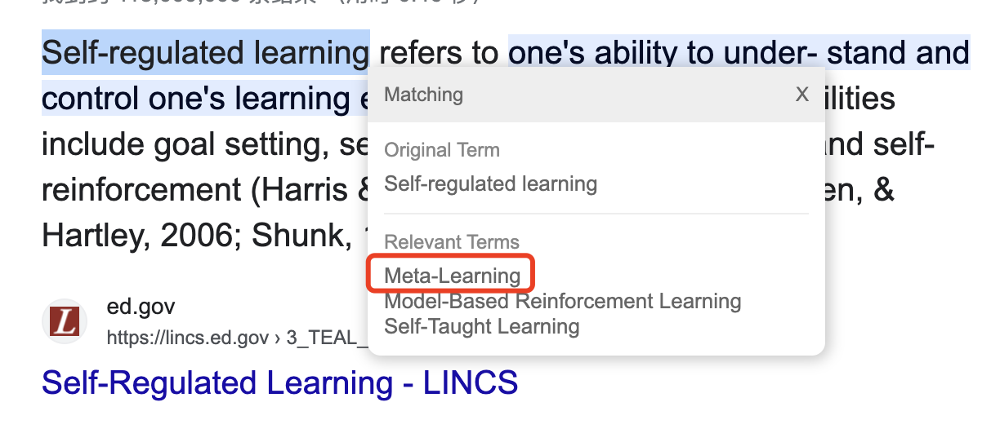

# Term-converter-chrome-extension
### Descrption

This is a final project of 23Spring Deep Learning class in Renmin Univerity, where we were asked to develop a novel application based on Large Language Models(LLMs). We developed a tool aimed at converting terms in foreign fields into ones that users already familiar with, in order to make the process of absorbing new knowledge easier and more enjoyable. The project took form of a chrome extension. 

A great example to help you understand: Imagine that you were an expert in Natual Language Progress(NLP), and you want to learning something about Linguistic to further your study. When reading literatures, you came across a term **Focus**, which breifly means the most outstanding part in a sentence. But you didn't know that, so you turned to Wikipedia for defination. After a tedious process, you finally read throgh the context and came to realize that it is very close to **Attention Mechanism** in your field. Then this thought hit you: if I knew this term is related to attention machanism beforehand, that's enough!

This application can help you. Once you selcect the term with your cursor, a floating box appears immediately on that spot and gives you three posible relevant terms in your field. In this case, the correct term ranked first. Now you can understand new concepts painlessly. 

Unfortunately, due to limitation of time and funding, at this moment, our application only support converting terms in other fields into Artificial Intelligence, the standard vocabulary bank of which comes from a open-source project in Github. Since we are quite interested in this application, hopefully we will expand it over other fields and enable it with other ablilities(eg. find relevant terms given description of a new concept). If you have any suggestion or relevant real-world demand, please feel free to open an issue.

If you are interested in methods behind it, this arXiv paper(course project report) gives further details. 

### Try it Locally 

#### Download and Install 

- Clone this repo to any local location.

- Turn on developer's mode in [chrome://extensions/](chrome://extensions/).

- Click *load unzipped extension* botton and select *term-converter-chrome-extension* folder in local storage of this repo.

- You can see it on extension management page if successfully loaded.

#### Run

- Before anything, make sure your IP address have access to [OpenAI](https://openai.com/). If you are currently in restricted area(eg. Mainland China), you have to resort to VPN service for help. 
- Once launched this extension, a small box pops up:

- Click *Target Field Selection*, then your will be redericted to a configuration page where you set the target field. (Note: Currently only field Artificial Intelligence is provided, but **you still need to confirm it by a click**, for it is a neccessary step for initialize the plugin)

    

- Click Start. 

    

- Move your cursor to select concepts on any webpage, and the floating box we presented above appear right away and top3 relevant terms in given field will show up within a second.

    

### Acknowledgement

The target terms we use in field Artiafical Intellegence to create training/validation set come from [ATID](https://github.com/jiqizhixin/Artificial-Intelligence-Terminology-Database/tree/master), a comprehensive mapping database of English to Chinese technical vocabulary in the artificial intelligence domain.

The application eventually takes the form of chrome extension, which functions very slimilar to a selection translation tool. The user interface was inspired by as well as modified from a GitHub public repo [chrome-extension-translate](https://github.com/CaTmmao/chrome-extension-translate).

The service behind our application are supported by [OpenAI](https://openai.com/). Our underlying model is fine-tuned based on *davinci*, and tuning and inferencing are all completed through OpenAI API.

### One more thing

In our uploaded source code, we explicitly refered OpenAI API key, which we know to be a **very bad practice**. But we still do that because this project is made for experimental purpose and the account is registered only for this project. However, if any anormal behavior are detected, we will have to terminate our service. 

